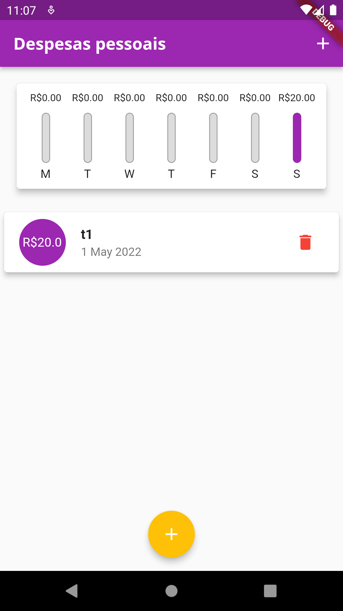

<h1 align="center">
    Expenses
</h1>
 

Projeto criado para aprendizagem em flutter, segue a baixo as telas do app

 

Telas do App

Com o app é possivel você controlar suas finançãs, adicionar suas movimentações financeiras e remove-las, e através do grafico você pode ver o que foi gasto durante a semana

    
    
    

